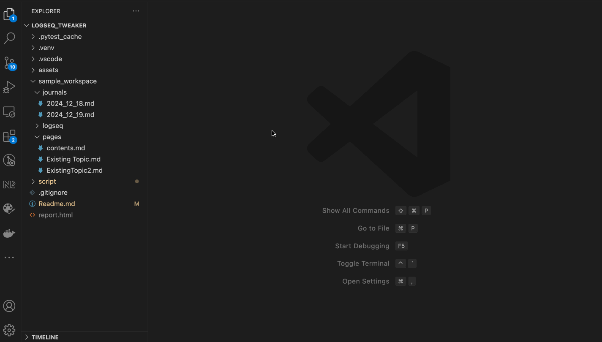

## Goal
A program that parses journal entries, helps find tags & child blocks in journals and copies/moves them to the actual page

## Trigger
[This reddit post](https://www.reddit.com/r/logseq/comments/1hhnwhs/logseq_and_what_happens_if_i_want_to_change_the/?utm_source=share&utm_medium=web3x&utm_name=web3xcss&utm_term=1&utm_content=share_button)

## Structure
- sample_workspace: A sample Logseq workspace
- script/logseq_tweaker.py: The script that does the work


## Demo


## Execution
* Recommended: Take a backup of your workspace
* Clone this repo locally
* Navigate into the 'script' folder
* Install Poetry (if not already installed):
```
curl -sSL https://install.python-poetry.org | python3 -
```
* Install dependencies:
```
poetry install
```
* Rename the file `example.env` to `.env` and tweak it appropriately (ex: specify the path to your workspace)
* Run the program
```
python ./script/logseq_tweaker.py
```

## Before & After
* The example below shows sample markdown in a journal
```
- A note about [[Virtual Topic]]
	- 1st Content added to the virtual topic which should be moved to the topic itself
- A duplicate note about [[Virtual Topic]]
	- 2nd Content added to the virtual topic which should be moved to the topic itself
```
* Such entries above will be copied to a new file: "Virtual Topic.md" as below
```
- [[2024_12_19]]
	- 1st Content added to the virtual topic which should be moved to the topic itself
	- 2nd Content added to the virtual topic which should be moved to the topic itself
```

## Features/Roadmap
_Add any you'd like to see as issues_

- [x] Find all references in journals
- [x] List all references which don't exist as files 
- [x] List all references which have sub-blocks directly in a journal
- [x] Create files for missing references & copy/move the blocks to the file
- [x] Handle files which already exist
- [x] Handle sub-folders
- [ ] Bug: Indentations are not retained in `CHILD_BLOCK_STRICT_MODE=Y` mode
- [ ] Add support to exclude certain tags (ex: `#A` used for prioritisation of tasks)
- [ ] Bug: Add more resiliancy. A File handling error will cause the entire program to terminate
- [ ] Handle namespaces

## Unit tests
* Install pytest: `pip install pytest-html`
* Run all tests: `pytest --html=report.html`

## Disclaimer
THIS SOFTWARE IS PROVIDED “AS IS” AND ANY EXPRESS OR IMPLIED WARRANTIES, INCLUDING, BUT NOT LIMITED TO, THE IMPLIED WARRANTIES OF MERCHANTABILITY AND FITNESS FOR A PARTICULAR PURPOSE ARE DISCLAIMED. IN NO EVENT SHALL THE CONTRIBUTORS BE LIABLE FOR ANY DIRECT, INDIRECT, INCIDENTAL, SPECIAL, EXEMPLARY, OR CONSEQUENTIAL DAMAGES (INCLUDING, BUT NOT LIMITED TO, PROCUREMENT OF SUBSTITUTE GOODS OR SERVICES; LOSS OF USE, DATA, OR PROFITS; OR BUSINESS INTERRUPTION) HOWEVER CAUSED AND ON ANY THEORY OF LIABILITY, WHETHER IN CONTRACT, STRICT LIABILITY, OR TORT (INCLUDING NEGLIGENCE OR OTHERWISE) ARISING IN ANY WAY OUT OF THE USE OF THIS SOFTWARE, EVEN IF ADVISED OF THE POSSIBILITY OF SUCH DAMAGE.

## Misc
I wanted to also experiment with python - a language I'm not familiar with so most of the code was generated using ChatGPT & CoPilot on VS Code
* [Prompt log 1](https://chatgpt.com/share/6764dcd0-7d58-800e-b2ac-9cdc7636553c)
* [Prompt log 2](https://chatgpt.com/share/6764dcf8-49a4-800e-9e01-514a8e3e6be8)